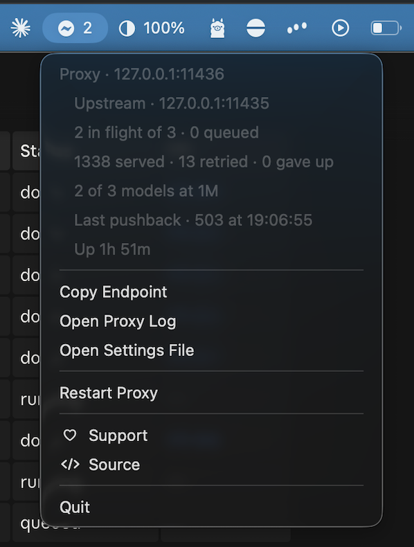
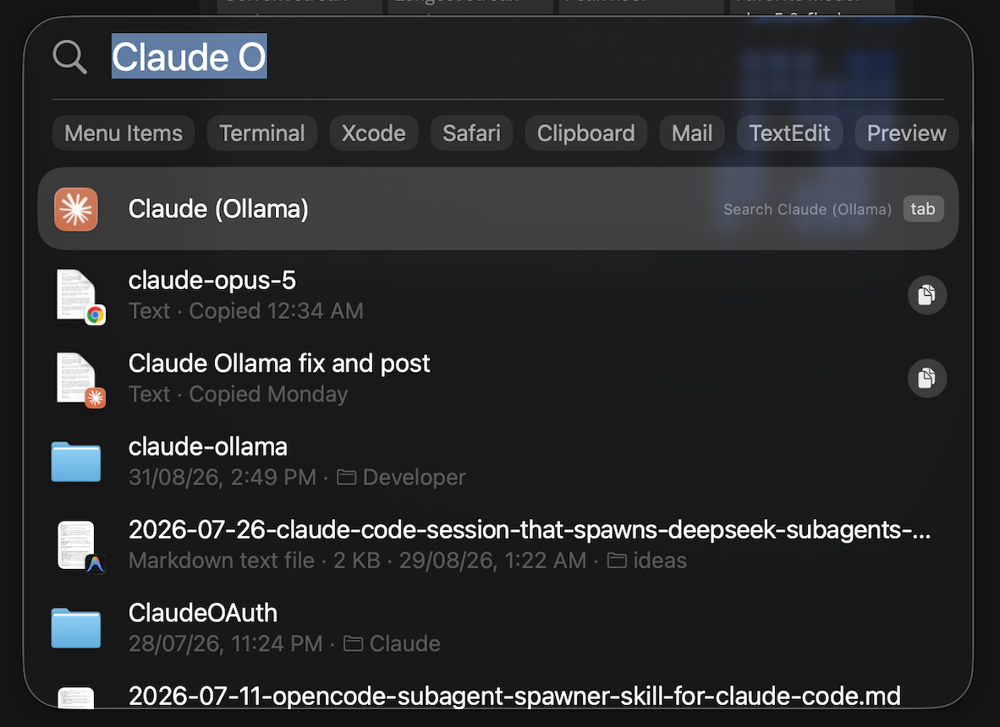
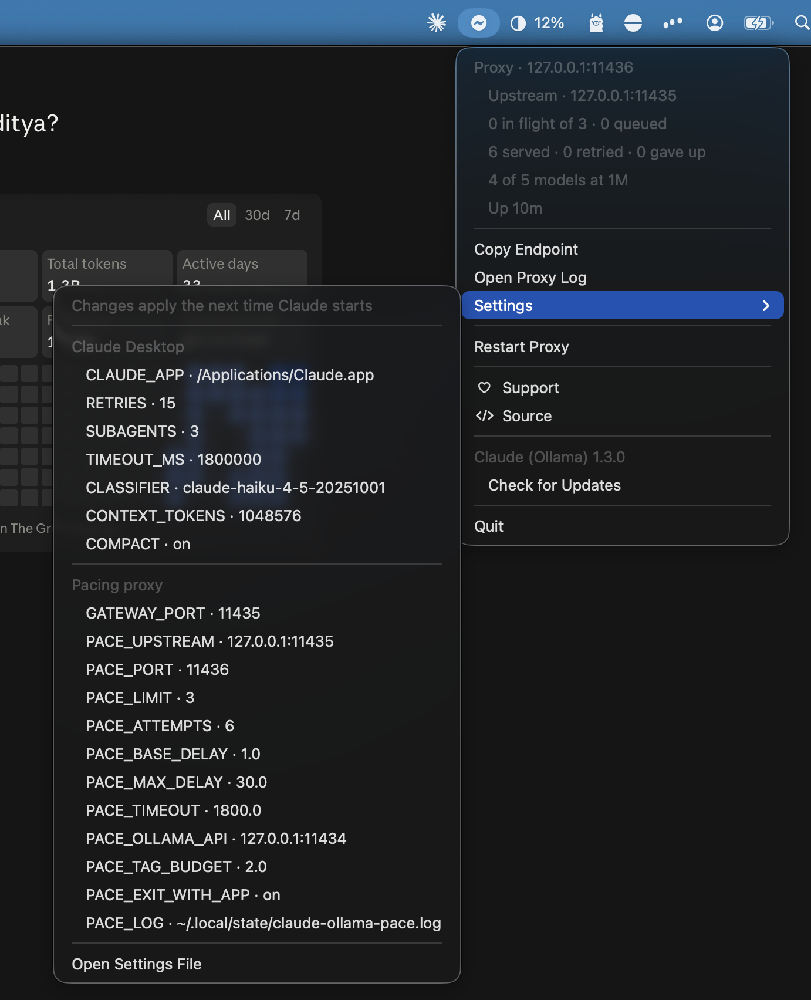
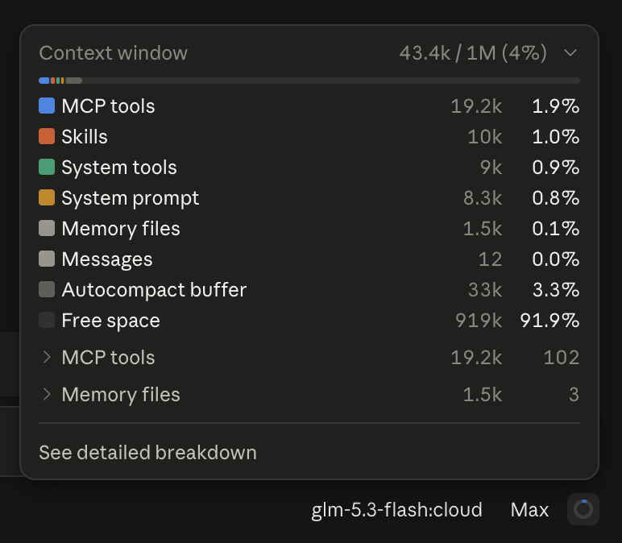

<div align="center">


<h1>Claude (Ollama)</h1>

<p>
  <b>Claude Desktop, pointed at a local Ollama gateway,<br>
  without editing anything the app owns.</b>
</p>

<p>
  <a href="https://github.com/aaditya-v-more/claude-ollama/releases/latest"></a>
  <a href="https://github.com/aaditya-v-more/homebrew-tap"></a>
  
  <a href="LICENSE"></a>
  <a href="https://ko-fi.com/aadityavmore"></a>
</p>

<p>
  <a href="https://aaditya-v-more.github.io/claude-ollama/"><b>Website</b></a>
  &nbsp;·&nbsp;
  <a href="#install"><b>Install</b></a>
  &nbsp;·&nbsp;
  <a href="https://github.com/aaditya-v-more/claude-ollama/releases"><b>Releases</b></a>
</p>

<br>



</div>

A launcher sets the tuning as process environment only, a small proxy paces
requests against the gateway and repairs what it gets wrong, and a menu bar item
shows what is going on.

## Before you install

Two things have to be in place, and this installs neither.

**Claude Desktop**, in `/Applications`.

**Ollama's gateway, switched on.** It is off by default. In the Ollama app open
**Apps** and turn **Claude** on. For cloud models, sign in to Ollama and enable
those as well — some need a paid plan. Until that is done nothing is listening
on `127.0.0.1:11435` and none of this will work.

## Install

```sh
brew install --cask aaditya-v-more/tap/claude-ollama
```



It goes into `/Applications`, so Spotlight and Launchpad find it by name.

## Use

Open **Claude (Ollama)** — the app this installs, not Claude Desktop itself.
That is the whole point of it: opening Claude directly skips the launcher, so
nothing is pointed at the proxy and none of the overrides are set. Every launch
has to go through this one.

From it, the proxy starts, the profile's endpoint is pointed at it, and Claude
Desktop opens with the overrides in its environment. The menu bar item above
appears alongside it.

Everything else is in that menu. Every setting is listed with its current value
and will take a new one, applied the next time Claude starts.



The app keeps itself up to date, and both it and the proxy quit when Claude
does.

Models that can do a million tokens are used as such. Claude Desktop decides
that by matching `[1m]` in the model ID and the gateway never sets it, so
without this every model falls back to 200k regardless of what it can actually
do — the proxy reads each one's real context length from Ollama and tags the
catalog with it.



## Uninstall

```sh
brew uninstall --cask claude-ollama
```

Add `--zap` to take the settings file and the proxy log with it. Your chats live
in Claude Desktop's own profile and are left alone either way.

## Building from a checkout

```sh
./Tools/make-app.sh . "$PWD/bin/claude-ollama"
./bin/claude-ollama install-app
```

Such a build will otherwise replace itself with a released one, so stop it
looking:

```sh
defaults write local.aaditya.claude-ollama-launcher SUEnableAutomaticChecks -bool false
```

`claude-ollama --help` lists the rest of the commands.

---

[What it does and why](https://aaditya-v-more.github.io/claude-ollama/) &middot;
MIT &middot; [Tip jar](https://ko-fi.com/aadityavmore)
